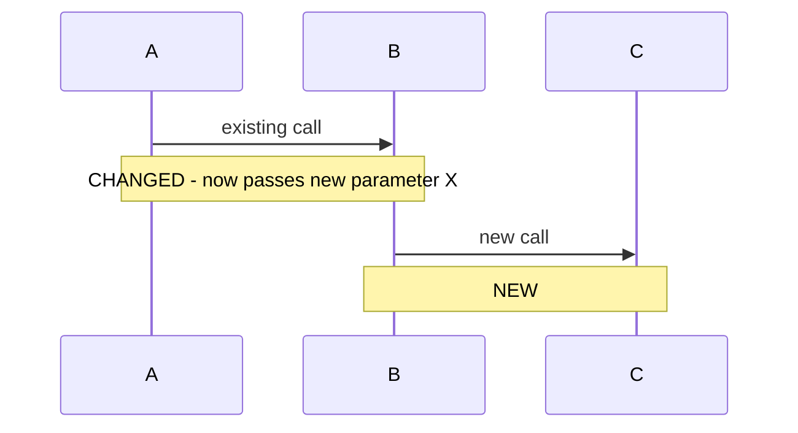

# Sequence Diagrams

Auto-renders a Mermaid sequence diagram in `/pr-intel` briefings for M+ PRs touching
2+ services. Targets the reviewer audience that skims PRs across services (a team lead, a team lead manager,
the engineering lead); a diagram carries more signal than another bullet of prose about call-path
changes.

Status: experimental enhancement, personal-tier first per lab-to-production rule.
Tracked in bead `docr-lvaq`.

## When to emit

Render a diagram when ALL of:
1. Size is M, L, XL, 2XL, or 3XL (XS/S excluded; the diagram-cost-vs-signal ratio
   is wrong for small PRs)
2. `multi_service: true` (changed files span 2+ service directories under
   `src/python/mx2/`, `src/typescript/mx2/`, or `infra/<service>/`)
3. The diff contains identifiable call-path changes: new function calls between
   services, new event publishes, new API requests, new queue sends, OR changes
   to the order/conditions of existing inter-service calls
4. Mode is `default` (skip for `--mine` and `--quick`)

Skip when:
- The diff is a pure refactor with no inter-service behavior change
- All changes are within a single service even if multiple files (covered by clause 2)
- The diff is too sprawling to summarize in a single coherent sequence (cap: if the
  diff touches > 6 services, emit nothing rather than a degenerate diagram)

## Detection: `multi_service` signal

Add to SKILL.md Dispatch Signals. Compute from net-new file paths only (exclude
stale files per Merge Base Freshness):

```
multi_service: count of distinct top-level service directories among changed files >= 2
```

Service directory definitions:
- Python: `src/python/mx2/<service>/` - first path segment after `src/python/mx2/` is the service
- TypeScript: `src/typescript/mx2/<app>/` - first segment after `src/typescript/mx2/`
- Infra: `infra/<service>/` - first segment after `infra/`

Files outside these prefixes (root scripts, top-level configs, generated code) do
not count toward the service count.

## Generation approach

LLM-driven summarization of the diff. Do NOT attempt full static call-graph analysis;
that's heavyweight and fragile. The LLM reads the diff plus enough surrounding context
to identify the call path changes, then emits Mermaid.

Prompt the rendering step with:

```
Given this diff, identify the inter-service call-path changes and render them as a
Mermaid sequence diagram. The diagram should show how a request, event, or operation
flows across services AFTER this change. Only include services that the diff touches
or that are direct upstream/downstream of touched services.

Rules:
1. Use `sequenceDiagram` syntax.
2. Each participant is a service name (one word, no spaces).
3. Each arrow is a real call or event publish that exists or is changed in the diff.
4. Annotate new/changed arrows with `Note over X,Y: NEW` or `Note over X,Y: CHANGED`.
5. Do NOT invent arrows. If you cannot identify a clear sequence from the diff,
   output the literal string `SEQUENCE_UNCLEAR` and nothing else.
6. Maximum 8 participants. Maximum 15 arrows. If exceeded, output `SEQUENCE_TOO_LARGE`.
7. Do not include style directives, themes, or links - plain Mermaid only.

Diff:
<diff>
```

Post-process the output:
- If `SEQUENCE_UNCLEAR` or `SEQUENCE_TOO_LARGE`: omit the section entirely
- Otherwise: validate the Mermaid by checking the first non-blank line is
  `sequenceDiagram`; if not, omit the section
- Wrap in a `\`\`\`mermaid` fenced block in the briefing output

## Integration with output

A new optional section appears in `output-formats.md` (default mode only), placed
AFTER `Scope` and BEFORE `Review Recommendation`:

```
### Sequence Diagram


```

The section is omitted entirely when either the gating conditions are not met or the
LLM emits a fallback sentinel.

## Validation rules

For each generated diagram, before emitting:

1. **Syntax check**: pipe through a lightweight Mermaid validator if available, OR
   apply structural checks (first line is `sequenceDiagram`, participants declared
   before use, arrows match `->>` or `-->>` pattern).
2. **Grounding check**: every arrow must correspond to an identifiable call or event
   in the diff. If you cannot point at a diff line that motivates an arrow, drop the
   arrow. Better to show fewer arrows than to fabricate relationships.
3. **Hallucination check**: never name a service that isn't either touched by the diff
   OR explicitly referenced in the diff as a call target. If the LLM names `auth` or
   `redis` from general training but those don't appear in the diff or the repo, drop
   that participant.

## What this does NOT replace

- The Scope summary still describes what files changed and the rough blast radius.
- Specialist findings still drive Draft Inline Comments and the Review Summary.
- The diagram is supplementary signal for cross-service reviewers, not a replacement
  for understanding the diff.

## First-run validation

Bead AC requires testing on 2 recent merged M+ cross-service PRs. Pick PRs that:
- Touch >= 2 service directories
- Have a clear request/event flow (not pure refactors)
- Predate this feature so the diagrams weren't seen during original review

For each test PR, manually evaluate:
- Does the diagram accurately reflect the diff? (no invented relationships)
- Would the diagram have helped you understand the PR faster on first read?
- Are the NEW/CHANGED annotations correct?

Record results in the bead. If 0 of 2 validations pass, drop the feature; the LLM
summarization approach doesn't work and we'd need static call-graph analysis (out of
scope for the experimental P3 phase).
